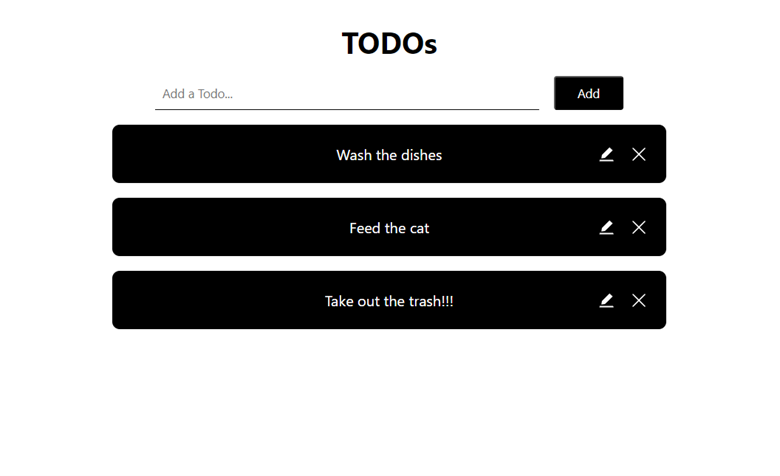

# TODOs

TODOs is todo list that allows the users to view, create, update and delete entries.


## Built With



Visit the [api](https://todo-mern-383i.onrender.com/api/todos) and [live preview](https://todo-mern-frontend.onrender.com/).


## Installation

Clone the repository, change to the directory and use npm scripts separately to install the dependencies of the server and client

```sh
$ git clone https://github.com/gbgabiola/todo-mern
$ todo-mern
$ npm run install-server # cd to backend & npm install
$ npm run install-client # cd to frontend & npm install
```


## Usage


Rename `.env.example` file into `.env` add your mongoDB URI credential:

```sh
MONGO_URI=mongodb+srv://<username>:<password>@cluster0.iwurr.mongodb.net/
```

Run the server and client:

```sh
$ npm run start-server
$ npm run start-client
or 
$ npm run build-client
```

Open now the browser and launch:
- [api - localhost:3001](https://localhost:3001)
- [site - localhost:3000](https://localhost:3000)


## Git Commands Used

```ssh
$ git remote add origin ...
$ git status
$ git add
$ git commit
$ git commit --amend --no-edit
$ git checkout -b <branch>
$ git merge <branch>
$ git push -u origin <branch>
$ git log
```
